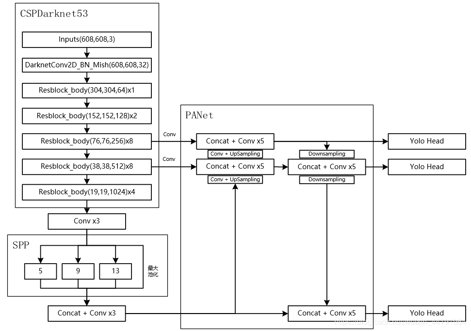
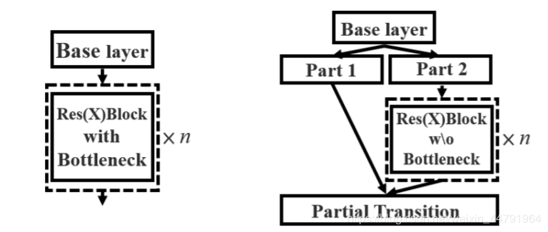

## YOLOV4：You Only Look Once目标检测模型在pytorch当中的实现
[参考博客](https://blog.csdn.net/weixin_44791964/article/details/106214657)





### 目录
1. [实现的内容 Achievement](#实现的内容)
2. [所需环境 Environment](#所需环境)
3. [注意事项 Attention](#注意事项)
4. [小技巧的设置 TricksSet](#小技巧的设置)
5. [文件下载 Download](#文件下载)
6. [预测步骤 How2predict](#预测步骤)
7. [训练步骤 How2train](#训练步骤)
8. [参考资料 Reference](#Reference)

### 实现的内容
- [x] 主干特征提取网络：DarkNet53 => CSPDarkNet53
- [x] 特征金字塔：SPP，PAN
- [x] 训练用到的小技巧：Mosaic数据增强、Label Smoothing平滑、CIOU、学习率余弦退火衰减
- [x] 激活函数：使用 Mish 激活函数

### 所需环境
torch==1.2.0

### 注意事项
代码中的 yolo4_weights.pth 是基于 608x608 的图片训练的，但是由于显存原因。我将代码中的图片大小修改成了 416x416。有需要的可以修改回来。 
代码中的默认 anchors 是基于 608x608 的图片的。   

**注意不要使用中文标签，文件夹中不要有空格！**   

**在训练前需要务必在 model_data 下新建一个 txt 文档，文档中输入需要分的类，在 train.py 中将 classes_path 指向该文件**。  

### 小技巧的设置
在train.py文件下：   
1、mosaic 参数可用于控制是否实现 Mosaic 数据增强。   
2、Cosine_scheduler 可用于控制是否使用学习率余弦退火衰减。   
3、label_smoothing 可用于控制是否 Label Smoothing 平滑。

### CSPNet 网络结构
CSPNet结构并不复杂，就是将原来的残差块的堆叠进行了一个拆分，拆成左右两个部分：
1. 主干部分继续进行原来的残差块的堆叠；
2. 另一部分则像是一个残差边一样，经过少量处理直接连接到最后。
因此可以认为 CSP 中存在一个大的残差边。

### Mosaci 数据增强
1. 每次读取四张图片；
2. 分别对这四张图片进行翻转，缩放，色域变化等，并且按照四个方向位置摆好；
3. 进行图片的组合和框的组合。

### Label Smoothing - 防止过拟合
在分类模型当中，经常对标签使用one-hot的形式，然后去预测属于每一个标签的概率，如果不考虑多标签的情况下，选择概率最大的作为我们的预测标签。
但是在实际过程中可能会存在两个问题。

（1）可能导致过拟合。

（2）模型对于预测过于自信，以至于忽略可能的小样本标签。

产生上述问题的原因就是因为我们真正在计算交叉熵损失函数的时候，对于真实标签概率的取值要么是1，要么是0，表征我们已知样本属于某一类别的概率是为1的确定事件，属于其他类别的概率则均为0。

Label Smoothing的原理就是为损失函数增强其他标签的损失函数值，类似于其为非标签增加了一定的可选择性。

注:如果分类准确，也就是说交叉熵对分类正确给的是最大激励，但实际上有一些标注数据并不一定是准确的。所以使用上述标签并不一定是最优的。

### 学习率余弦退火衰减：
1. 学习率会先上升再下降，这是退火优化法的思想。
2. 上升的时候使用线性上升，下降的时候模拟cos函数下降。执行多次。

### Loss
可以参考这个：[YOLO V4 解析](https://www.cnblogs.com/cucwwb/p/13166288.html)

loss 的计算过程：
loss 值需要对三个特征层进行处理，这里以最小的特征层为例。
1. 利用 y_true 取出该特征层中真实存在目标的点的位置 (m,19,19,3,1) 及其对应的种类 (m,19,19,3,80)。
2. 将 prediction 的预测值输出进行处理，得到 reshape 后的预测值 y_pre，shape 为 (m,19,19,3,85)。还有解码后的xy，wh。
3. 对于每一幅图，计算其中所有真实框与预测框的IOU，如果某些预测框和真实框的重合程度大于0.5，则忽略。
4. 计算 ciou 作为回归的 loss，这里只计算正样本的 回归 loss。
5. 计算置信度的 loss，其有两部分构成：
   第一部分是实际上存在目标的，预测结果中置信度的值与 1 对比；
   第二部分是实际上不存在目标的，在第四步中得到其最大 IOU 的值与 0 对比。
6. 计算预测种类的 loss，其计算的是实际上存在目标的，预测类与真实类的差距。

其实际上计算的总的loss是三个loss的和，这三个loss分别是：

（1）实际存在的框，CIOU LOSS。

（2）实际存在的框，预测结果中置信度的值与1对比；实际不存在的框，预测结果中置信度的值与0对比，该部分要去除被忽略的不包含目标的框。

（3）实际存在的框，种类预测结果与实际结果的对比。

### 文件下载
训练所需的 yolo4_weights.pth 可在百度网盘中下载。  
链接: https://pan.baidu.com/s/1VNSYi39AaqjHVbdNpW_7sw 提取码: q2iv  
yolo4_weights.pth是coco数据集的权重。  
yolo4_voc_weights.pth是voc数据集的权重。

### 预测步骤
#### 1、使用预训练权重
a、下载完库后解压，在百度网盘下载yolo4_weights.pth或者yolo4_voc_weights.pth，放入model_data，运行predict.py，输入  
```python
test_img/street.jpg
```
可完成预测。  
b、利用video.py可进行摄像头检测。  

#### 2、使用自己训练的权重
a、按照训练步骤训练。  
b、在yolo.py文件里面，在如下部分修改model_path和classes_path使其对应训练好的文件；**model_path对应logs文件夹下面的权值文件，classes_path是model_path对应分的类**。  
```python
_defaults = {
    "model_path": 'model_data/yolo4_weights.pth',
    "anchors_path": 'model_data/yolo_anchors.txt',
    "classes_path": 'model_data/coco_classes.txt',
    "model_image_size" : (416, 416, 3),
    "confidence": 0.5,
    "cuda": True
}
```
c、运行predict.py，输入  
```python
test_img/street.jpg
```
可完成预测。  
d、利用video.py可进行摄像头检测。  

### 训练步骤
1、本文使用VOC格式进行训练。  
2、训练前将标签文件放在VOCdevkit文件夹下的VOC2007文件夹下的Annotation中。  
3、训练前将图片文件放在VOCdevkit文件夹下的VOC2007文件夹下的JPEGImages中。  
4、在训练前利用voc2yolo4.py文件生成对应的txt。  
5、再运行根目录下的voc_annotation.py，运行前需要将classes改成你自己的classes。**注意不要使用中文标签，文件夹中不要有空格！**   
```python
classes = ["aeroplane", "bicycle", "bird", "boat", "bottle", "bus", "car", "cat", "chair", "cow", "diningtable", "dog", "horse", "motorbike", "person", "pottedplant", "sheep", "sofa", "train", "tvmonitor"]
```
6、此时会生成对应的2007_train.txt，每一行对应其**图片位置**及其**真实框的位置**。  
7、**在训练前需要务必在model_data下新建一个txt文档，文档中输入需要分的类，在train.py中将classes_path指向该文件**，示例如下：   
```python
classes_path = 'model_data/new_classes.txt'    
```
model_data/new_classes.txt文件内容为：   
```python
cat
dog
...
```
8、运行train.py即可开始训练。

### mAP目标检测精度计算更新
更新了get_gt_txt.py、get_dr_txt.py和get_map.py文件。  
get_map文件克隆自https://github.com/Cartucho/mAP  
具体mAP计算过程可参考：https://www.bilibili.com/video/BV1zE411u7Vw

### Reference
https://github.com/qqwweee/keras-yolo3/  
https://github.com/Cartucho/mAP  
https://github.com/Ma-Dan/keras-yolo4  
